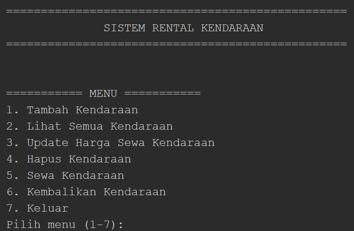

# Sistem Rental Kendaraan — Tugas PBO

## 📌 Identitas
- **Nama** : Rivalio Chendra
- **NIM**  : 2509116039
- **Mata Kuliah** : Pemrograman Berorientasi Objek
- **Kelas** : A

---

## 📖 Deskripsi Proyek 

Program ini adalah **Sistem Rental Kendaraan** berbasis Command Line Interface (CLI) yang dibuat menggunakan bahasa pemrograman Java. Program mensimulasikan proses bisnis rental kendaraan sederhana yang biasa dijumpai di lapangan, mulai dari pendataan armada, proses penyewaan, hingga pengembalian kendaraan.

Melalui program ini, admin (pengguna) dapat:
- Mengelola data kendaraan: menambah, melihat, mengubah harga sewa, dan menghapus data
- Menyewakan kendaraan kepada penyewa, lengkap dengan perhitungan **total biaya sewa** otomatis berdasarkan jumlah hari
- Mengembalikan kendaraan yang telah selesai disewa

Program dirancang dengan dua jenis kendaraan yang berbeda, yaitu **Mobil** dan **Motor**, yang masing-masing memiliki atribut dan aturan perhitungan biaya sewa yang khas. Kendaraan-kendaraan ini dikelola melalui satu daftar (`List<Kendaraan>`) yang sama, memanfaatkan konsep **Inheritance** dan **Polymorphism** sehingga kode program tetap ringkas, mudah dibaca, dan mudah dikembangkan.

### Konsep OOP yang diterapkan
| Konsep | Penerapan dalam Program |
|---|---|
| **Inheritance** | `Mobil` dan `Motor` sama-sama mewarisi (`extends`) class `Kendaraan` |
| **Polymorphism — Overriding** | `tampilkanInfo()` dan `hitungTotalBiaya()` ditimpa ulang di `Mobil` dan `Motor` dengan perilaku berbeda |
| **Polymorphism — Overloading** | Method `sewa()`, `setHargaSewaPerHari()`, dan `hitungTotalBiaya()` dibuat dalam beberapa versi parameter berbeda |
| **Condition (if-else)** | Validasi harga, pengecekan status kendaraan, pengecekan jenis kendaraan saat input, dll |
| **Looping** | `for` untuk menampilkan/mencari data kendaraan, `do-while` untuk menu utama yang berulang |

---

## 🗂️ Struktur Project

```text
RentalKendaraan/
├── src/
│   ├── com.mycompany.rentalkendaraan/
│   │   └── RentalKendaraan.java (main program)
│   │
│   └── model/
│       ├── Kendaraan.java (superclass)
│       ├── Mobil.java     (subclass)
│       └── Motor.java     (subclass)
```

---

## 🧩 Hierarki Class
```text
                    ┌──────────────────────────┐
                    │ Kendaraan (Superclass)   │
                    ├──────────────────────────┤
                    │ - namaKendaraan          │
                    │ - platNomor              │
                    │ - hargaSewaPerHari       │
                    │ - status                 │
                    │ - namaPenyewa            │
                    └────────────┬─────────────┘
                                 │
                    ┌────────────┴─────────────┐
                    │                          │
                 extends                    extends
                    │                          │
          ┌─────────┴─────────┐      ┌─────────┴────────┐
          │ Mobil (Subclass)  │      │ Motor (Subclass) │
          ├───────────────────┤      ├──────────────────┤
          │ - jumlahKursi     │      │ - kapasitasCC    │
          │ - BIAYA_SUPIR_    │      │ - DISKON_        │
          │   PER_HARI        │      │   MINGGUAN       │
          └───────────────────┘      └──────────────────┘
```

**Penjelasan hubungan IS-A:**
- `Mobil` **IS-A** `Kendaraan` (Mobil adalah sebuah Kendaraan)
- `Motor` **IS-A** `Kendaraan` (Motor adalah sebuah Kendaraan)

Kedua subclass mewarisi seluruh atribut umum (`namaKendaraan`, `platNomor`, `hargaSewaPerHari`, `status`, `namaPenyewa`) dan method umum dari superclass `Kendaraan`, lalu masing-masing menambahkan atribut khas dan menimpa ulang sebagian perilaku sesuai karakteristik jenis kendaraannya.

---

## 🔑 Superclass dan Subclass

### 1. `Kendaraan` (Superclass)

Class dasar yang menyimpan data dan perilaku umum yang dimiliki **semua** jenis kendaraan.

**Atribut:**
- `namaKendaraan` — nama/merk kendaraan
- `platNomor` — nomor plat sebagai identitas unik kendaraan
- `hargaSewaPerHari` — tarif sewa per hari
- `status` — status kendaraan (`"Tersedia"` / `"Disewa"`)
- `namaPenyewa` — nama penyewa saat ini (`"-"` jika belum disewa)

**Method penting:**
- `setHargaSewaPerHari(double)` — mengubah harga sewa, dengan validasi `if` agar harga tidak boleh negatif
- `setHargaSewaPerHari()` — versi **overload** tanpa parameter, digunakan untuk mereset harga sewa ke 0
- `sewa(String namaPenyewa)` — mengubah status kendaraan menjadi "Disewa" dan mencatat nama penyewa
- `sewa(String namaPenyewa, int jumlahHari)` — versi **overload** dari `sewa()`, langsung menghitung dan mengembalikan total biaya sewa berdasarkan jumlah hari
- `kembalikan()` — mengembalikan status kendaraan menjadi "Tersedia" dan mereset data penyewa
- `hitungTotalBiaya(int jumlahHari)` — menghitung total biaya sewa dasar (`hargaSewaPerHari × jumlahHari`); method inilah yang nantinya **di-override** oleh `Mobil` dan `Motor` agar masing-masing punya aturan hitung sendiri
- `tampilkanInfo()` — mencetak data umum kendaraan (plat, nama, harga, status, penyewa); method inilah yang juga **di-override** oleh subclass untuk menambahkan info spesifik

### 2. `Mobil` (Subclass)

Mewakili kendaraan roda empat dengan tambahan atribut dan aturan khusus.

**Atribut tambahan:**
- `jumlahKursi` — jumlah kursi/kapasitas penumpang mobil
- `BIAYA_SUPIR_PER_HARI` — biaya tambahan tetap (Rp100.000/hari) jika penyewa memilih opsi pakai supir

**Method:**
- `tampilkanInfo()` *(override)* — memanggil `super.tampilkanInfo()` lalu menambahkan baris info **jumlah kursi**
- `hitungTotalBiaya(int jumlahHari)` *(override)* — untuk Mobil, perhitungan mengikuti aturan dasar dari superclass (harga × hari), tanpa diskon
- `hitungTotalBiaya(int jumlahHari, boolean pakaiSupir)` *(overload)* — versi tambahan yang memperhitungkan biaya supir jika `pakaiSupir` bernilai `true`

### 3. `Motor` (Subclass)

Mewakili kendaraan roda dua dengan tambahan atribut dan aturan diskon khusus.

**Atribut tambahan:**
- `kapasitasCC` — kapasitas mesin motor dalam satuan cc
- `DISKON_MINGGUAN` — faktor diskon (0.9, setara potongan 10%) yang berlaku otomatis untuk penyewaan ≥ 7 hari

**Method:**
- `tampilkanInfo()` *(override)* — memanggil `super.tampilkanInfo()` lalu menambahkan baris info **kapasitas cc**
- `hitungTotalBiaya(int jumlahHari)` *(override)* — menghitung biaya dasar seperti superclass, lalu jika `jumlahHari >= 7`, total otomatis dikalikan `DISKON_MINGGUAN` (dapat diskon 10%)

### 4. `RentalKendaraan` (Main Program)

Class utama berisi `main()` dan seluruh logika interaksi dengan pengguna (menu, input, pemrosesan CRUD). Class ini menyimpan seluruh kendaraan dalam satu `List<Kendaraan>`, sehingga Mobil dan Motor dapat diperlakukan secara seragam lewat referensi tipe `Kendaraan` — inilah yang memungkinkan **polymorphism** benar-benar dimanfaatkan, misalnya saat menampilkan seluruh data kendaraan cukup dengan memanggil `k.tampilkanInfo()` di dalam satu `for` loop tanpa perlu mengecek tipe objek satu per satu.

---

## ⚙️ Fitur Program

| No | Fitur | Keterangan |
|----|-------|------------|
| 1 | Tambah Kendaraan | Menambahkan data Mobil atau Motor baru ke daftar |
| 2 | Lihat Semua Kendaraan | Menampilkan seluruh data kendaraan beserta atribut khusus tiap jenisnya (memanfaatkan polymorphism `tampilkanInfo()`) |
| 3 | Update Harga Sewa | Mengubah harga sewa per hari sebuah kendaraan berdasarkan plat nomor |
| 4 | Hapus Kendaraan | Menghapus data kendaraan dari daftar berdasarkan plat nomor |
| 5 | Sewa Kendaraan | Menyewakan kendaraan ke penyewa beserta jumlah hari sewa, lalu menghitung total biaya otomatis sesuai aturan tiap jenis kendaraan |
| 6 | Kembalikan Kendaraan | Mengembalikan status kendaraan menjadi tersedia kembali |
| 7 | Keluar | Mengakhiri program |

---

## ▶️ Alur Program (Petunjuk Eksekusi dan Cara Kerja Sistem)

1. **Compile** seluruh file Java (pastikan struktur folder `model/` dan `com/mycompany/rentalkendaraan/` tetap sesuai package-nya):
   ```bash
   javac model/*.java com/mycompany/rentalkendaraan/*.java -d out
   ```
2. **Jalankan** program:
   ```bash
   java -cp out com.mycompany.rentalkendaraan.RentalKendaraan
   ```
3. Saat program dijalankan, dua data kendaraan contoh (Toyota Avanza & Honda Beat) otomatis dimuat sebagai data awal.
4. Pengguna akan diarahkan ke **menu utama** dan dapat memilih angka 1–7 sesuai fitur yang diinginkan (lihat tabel Fitur Program di atas).
5. Program akan terus menampilkan menu secara berulang (`do-while`) sampai pengguna memilih **7 (Keluar)**.
6. Setiap aksi (tambah, hapus, sewa, dsb.) akan memberi pesan konfirmasi atau pesan error yang jelas (misalnya jika plat nomor tidak ditemukan, atau kendaraan sudah disewa orang lain).

---

## 🖼️ Penjelasan Gambar (Screenshot Output)

Berikut adalah dokumentasi hasil pengujian program beserta penjelasan dari setiap tahapan yang dijalankan.

### 1. Tampilan Menu Utama



Gambar di atas menunjukkan tampilan awal program saat pertama kali dijalankan. Program menampilkan judul aplikasi beserta daftar menu yang dapat dipilih oleh pengguna, mulai dari menambah data kendaraan hingga keluar dari program. Pada tahap ini, sistem juga telah memuat dua data kendaraan awal (Toyota Avanza dan Honda Beat) sebagai contoh data yang tersedia secara *default*.

---

### 2. Menambah Data Kendaraan


Gambar ini menampilkan proses penambahan data kendaraan baru melalui menu nomor 1. Pengguna diminta memasukkan jenis kendaraan (Mobil atau Motor), lalu mengisi data seperti nama kendaraan, plat nomor, harga sewa per hari, dan atribut spesifik sesuai jenisnya (jumlah kursi untuk Mobil, kapasitas CC untuk Motor). Setelah data berhasil diinput, program menampilkan pesan konfirmasi bahwa kendaraan baru telah berhasil ditambahkan ke dalam daftar.

---

### 3. Menampilkan Seluruh Data Kendaraan


Gambar ini memperlihatkan hasil dari menu nomor 2, yaitu daftar seluruh kendaraan yang tersimpan dalam sistem. Setiap baris menampilkan informasi lengkap kendaraan, meliputi plat nomor, nama kendaraan, harga sewa per hari, status ketersediaan (Tersedia/Disewa), serta nama penyewa jika kendaraan sedang disewa. Bagian ini membuktikan **polymorphism** berjalan dengan benar: program hanya memanggil satu method yang sama, `k.tampilkanInfo()`, di dalam satu loop, namun keluaran untuk Mobil otomatis menampilkan jumlah kursi dan keluaran untuk Motor otomatis menampilkan kapasitas cc — sesuai versi `tampilkanInfo()` milik masing-masing subclass yang meng-override superclass `Kendaraan`. Dapat dilihat bahwa Honda PCX yang sebelumnya saya buat terlihat pada bagian ini.

---

### 4. Mengubah Harga Sewa Kendaraan


Gambar ini menunjukkan proses pembaruan data melalui menu nomor 3. Pengguna memasukkan plat nomor kendaraan yang ingin diubah harganya, kemudian memasukkan nilai harga sewa yang baru. Program akan memvalidasi input tersebut (harga tidak boleh bernilai negatif) sebelum memperbarui data dan menampilkan pesan bahwa harga sewa telah berhasil diperbarui.

---

### 5. Menghapus Data Kendaraan


Gambar ini menampilkan proses penghapusan data melalui menu nomor 4. Pengguna memasukkan plat nomor kendaraan yang ingin dihapus, kemudian program mencari data tersebut dalam daftar dan menghapusnya jika ditemukan. Apabila plat nomor yang dimasukkan tidak terdaftar, program akan menampilkan pesan bahwa data tidak ditemukan.

---

### 6. Menyewa Kendaraan


Gambar ini memperlihatkan proses penyewaan kendaraan melalui menu nomor 5. Pengguna memasukkan plat nomor kendaraan, nama penyewa, dan jumlah hari sewa. Program terlebih dahulu memeriksa status kendaraan tersebut; apabila masih berstatus "Tersedia", maka status akan diubah menjadi "Disewa", nama penyewa akan tercatat, dan total biaya sewa akan dihitung otomatis melalui method `hitungTotalBiaya()` sesuai aturan masing-masing jenis kendaraan — Motor mendapatkan diskon 10% jika disewa 7 hari atau lebih, sedangkan Mobil dihitung sesuai tarif dasar (harga per hari dikali jumlah hari).

---

### 7. Mengembalikan Kendaraan


Gambar ini menunjukkan proses pengembalian kendaraan melalui menu nomor 6. Setelah pengguna memasukkan plat nomor kendaraan yang dikembalikan, program akan memeriksa apakah kendaraan tersebut sedang berstatus "Disewa". Jika benar, status kendaraan akan dikembalikan menjadi "Tersedia" dan data nama penyewa akan dihapus (direset), menandakan kendaraan tersebut sudah dapat disewa kembali oleh penyewa lain.

---

### 8. Keluar dari Program


Gambar ini memperlihatkan output yang keluar jika user memilih opsi ke 7.
